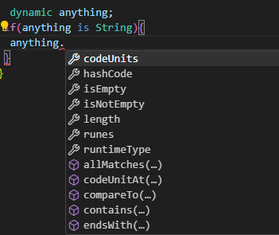

## Dart 강의 내용 정리 (0.0~1.7)

### 0.0 Welcome

- Flutter는 Dart 언어를 사용하는 프레임워크이다.
- Dart는 모든 플랫폼에서 빠른 앱을 만들 수 있는, 클라이언트에 최적화된 언어이다.
- Dart는 ① UI를 만드는데 최적화 되어있으며, ② hot reload를 통해 바로 결과를 확인할 수 있어 생산적으로 개발할 수 있으며, ③ 모바일·데스크탑·웹 등 모든 플랫폼에서 빠르게 동작한다.

<br>

### 0.1 Why Dart?

- `개발 환경에서는 JIT(Just In Time) 컴파일러`를 사용하여 빠른 피드백을 받을 수 있고, `배포 환경에서는 AOT(Ahead Of Time) 컴파일러`를 통해 컴파일된 앱을 배포한다.
- JIT 컴파일러는 `dart VM(dart 가상머신)`을 이용하여 컴파일한다. hot reload를 통해 변경사항을 즉각 확인할 수 있으며, 풍부한 디버깅 환경을 제공한다. 다만, 가상머신 위에서 돌아가기 때문에 상대적으로 느리다.
- `null-safety`를 적용하여 안전성이 뛰어나다.
- Flutter와 Dart 모두 `Google에서 개발`했기 때문에, Flutter를 위해 Dart 언어를 수정하는 등 지원을 받을 수 있다.

<br>

### 0.2 How to learn?

- [Dartpad](dartpad.dev): 별도 프로그램을 설치하지 않아도 `온라인` 상에서 Dart 코드를 작성할 수 있다.
- Flutter를 설치하면 자동으로 Dart도 설치된다.

<br>

## Flutter 설치

### 1. Flutter SDK 설치 방법 2가지

- [Flutter 홈페이지](https://docs.flutter.dev/get-started/install/windows)에서 Windows용 zip 파일 다운받아 설치하고 path 설정하기
- chocolatey를 통해 설치하기

<br>

### 2. chocolatey를 통해 flutter sdk 설치하기

- [chocolatey 홈페이지](https://chocolatey.org/install)에 접속하여 step2 설치방법 中 `Individual`을 선택한다.
- 컴퓨터에서 `PowerShell`을 `관리자 권한`으로 실행한다. (마우스 오른쪽 클릭)
- `Get-ExecutionPolicy` 명령어를 입력한 후, `Restricted`가 반환되면, `Set-ExecutionPolicy AllSigned`또는 `Set-ExecutionPolicy Bypass -Scope Process`을 입력한다.
  - ExecutionPolicy가 Restriced로 되어있으면 ps1 확장자의 스크립트 파일을 실행할 수 없기 때문에 이를 바꿔줘야한다.
  - Allsigned: 모든 스크립트에 서명이 있어야 실행 가능
  - Bypass: 모든 스크립트 실행 가능 (경고 표시x)
- chocolatey 홈페이지에서 flutter 다운로드 명령어를 복사하여 powershell에 입력한다.

```
Set-ExecutionPolicy Bypass -Scope Process -Force; [System.Net.ServicePointManager]::SecurityProtocol = [System.Net.ServicePointManager]::SecurityProtocol -bor 3072; iex ((New-Object System.Net.WebClient).DownloadString('https://community.chocolatey.org/install.ps1'))
```

- 설치가 끝나면 `choco`를 입력하여 chocolatey가 정상 설치되었는지 확인한다.
- powershell에 `choco install flutter`를 입력하여 설치를 진행한다. 설치 도중에 선택창이 출력되면 `y`를 입력한다.
- 설치가 끝나면 `flutter`를 입력하여 정상 설치되었는지를 확인한다.

<br>

### 3. 안드로이드 설치하기

- [Android Studio](https://developer.android.com/studio)를 다운받아 설치한다.
- 설치 후 Android Studio를 실행하면 Android Studio Setup Wizard가 뜨는데, 안드로이드 플러터 앱 개발에 필요한 다양한 툴을 최신버전으로 설치해주는 과정이니 따라서 진행한다.
- 설치가 완료되면 powershell에 `flutter doctor`를 입력하여 flutter에 android studio가 제대로 연결되었는지 확인한다. 에러 메세지가 나타나면 가이드에 따라 명령어를 입력하여 해결한다.
- `Android sdkmanager not found. Update to the latest Andorid SDK and ensure that the cmdline-tools are installed to resolve this.` 에러 해결 방법: Android Studio를 실행하여 SDK Manager -> Languages & Frameworks -> Android SDK -> SDK Tools에 들어가 Android SDK Command-line Tools를 찾은 후 왼쪽에 체크박스를 선택한 후 하단 ok버튼을 클릭하여 Android SDK Command-line Tools를 설치한다.
- `Some Android licenses are not accepted. To resolve this, run: flutter doctor --android-licenses` 에러 해결 방법: 해당 명령어 입력하면 SDK 패키지 동의 절차가 진행되며, 승인되지 않은 패키지가 있다고 뜨면 y를 눌러 동의해주면 된다.

<br>

### 4. vscode에서 dart 프로젝트 생성하기

- `Dart SDK 설치`: 컴퓨터에서 `Powershell`을 관리자 권한으로 실행한 후, `choco install dart-sdk`를 입력하여 Dart SDK를 설치한다. 중간에 선택창(run 'chocolateyinstall.ps1)이 나타나면 y를 눌러 설치를 계속 진행한다.

- vsocde 커맨드 창(단축키 ctrl+shift+p)에서 Dart:New Project 실행한다. `Could not find a Dart SDK` 에러 창이 뜨면 `Locate SDK`를 클릭한다. SDK 폴더 위치를 `C:\tools\dart-sdk`로 지정해준다.

- 확장자가 '.dart'인 파일을 생성하고, 아래와 같이 main 함수를 작성해준다. 코드 위에 Run 버튼을 클릭하면 콘솔창에 실행결과가 출력된다.

```dart
void main() {
  print('hi');
}
```

<br>

## Dart 강의 내용 정리 (1.0~1.7)

### 1.0 Hello World

- `main 함수`가 entry point이므로 반드시 작성해야 한다.
- 코드 끝에 `세미콜론(;)`을 반드시 입력해야한다. Dart에서는 의도적으로 세미콜론을 생략하는 경우가 있기 때문에, formatter가 자동으로 세미클론을 추가해주지 않는다.

<br>

### 1.1 The Var Keyword

- `변수 생성 방법`은 2가지가 있다. (① var 키워드 사용, ② 타입 지정)
- `var` 키워드를 사용하면 컴파일러가 자동으로 타입을 추론해준다. 값을 수정할 수 있으나, 다른 타입의 값으로 바꿀 수는 없다. 함수 내부에서 지역변수를 선언할 때 주로 사용한다.

```dart
  var fruit = "apple";
  fruit = "banana";
```

- String, Bool 등 `타입을 명시`하여 변수를 생성할 수도 있다. 클래스에서 속성을 정의할 때 주로 사용한다. 데이터 타입만 유지된다면 값을 업데이트할 수 있다.

```dart
  String animal = "dog";
  animal = "cat";
```

<br>

### 1.2 Dynamic Type

- `dynamic`은 여러가지 타입을 가질 수 있는 변수에 쓰는 키워드이다.

```dart
dynamic anything;
  anything = "char";
  anything = 1;
  anything = true;
```

- 꼭 필요할 때만 사용해야 한다.
- 데이터 타입이 확인되면, 타입별 메서드가 자동완성으로 제공된다.
  

<br>

### 1-3. Nullable Variables

- `null safety`: dart의 모든 변수는 non-nullable이다. null 값을 참조하려면 물음표(?) 기호를 붙여야 한다.

```dart
// 물음표 기호를 통해 null이 될 수 있음을 나타내준다.
  String? name = "rigood";
  name = null;

// 변수명 뒤에 물음표를 붙이거나, if문을 통해 데이터 타입을 확인한 후
// String 속성를 사용할 수 있다.
  name?.isEmpty;

  if (name != null) {
    name.isEmpty;
  }
```

<br>

### 1-4. Final Variables

- `final`는 값을 한번만 할당할 수 있는 변수에 사용하는 키워드이다.
- js나 ts의 const와 같은 개념으로 값을 수정할 수 없다.

```dart
final name = "rigood";
name = "nico" // (x) 재할당 불가
```

<br>

### 1-5. Late Variables

- `late`는 final, var 등 키워드 앞에 붙이는 수식어로, 초기 데이터 없이 변수를 선언할 수 있게 해준다. 값을 나중에 넣을 수 있다.
- 값을 할당하기 전에 변수를 호출하면 에러가 발생한다.
- data fetching 시 유용하게 쓸 수 있다.

```dart
late final String name;
// api 응답 받은 후 값 할당
name = "rigood";
```

<br>

### 1-6. Constant Variables

- `const`는 컴파일 할 때는 값을 알고 있는 변수에 사용하는 키워드이다.
- API나 사용자 입력을 통해 값을 받는 변수에는 사용할 수 없으며, 이 경우에는 final이나 var를 써야한다.

<br>

### 1-7. Recap

- **변수 생성 2가지 방법**
  - 타입 + 변수명 + 데이터 / class에서 property 나타낼 때 사용
  - var + 변수명 + 데이터 / fn, method에서 지역변수 선언할 때 사용
- 타입을 지킨다면 변수의 값은 수정할 수 있다.
- 변수 값을 수정하지 않으려면 **final**을 사용한다.
- **const** 역시 변수 값을 수정할 수 없다. const는 컴파일 될 때 값을 알고 있는 변수에 사용하고, final은 런타임에 값이 할당되는 변수에 사용한다.
- 어떤 데이터가 들어올지 모를 때는 **dynamic**을 사용한다. 타입이 확인되면 해당 타입 속성에 접근할 수 있다.
- dart의 모든 변수는 **non-nullable**이다. null을 참조하려면 **물음표**를 붙여줘야한다.
- **late**는 어떤 데이터가 올 지 모를 때 사용하는 수식어이다.
