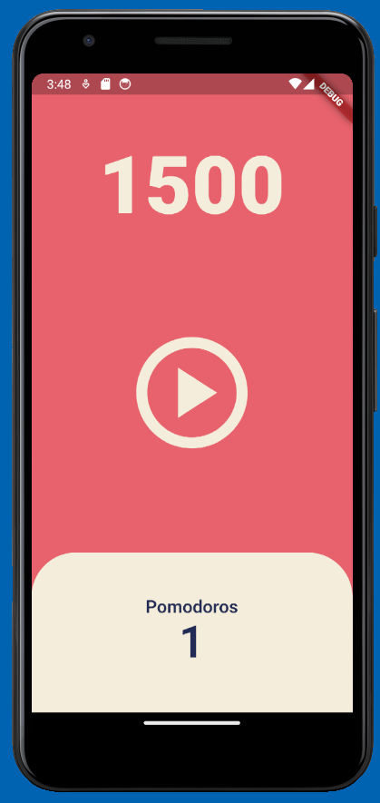

## 플러터 강의 내용 정리 (5.0~5.4)

### 5.0 User Interface

- `Pomodoro 앱`

    

  - 25분 일하고 5분 쉬는 생산성 타이머 앱이다.
  - UI는 크게 세 부분(25분짜리 카운터 + 재생 버튼 + 완료 횟수)으로 구성되어 있다.

- `파일 생성`

  - screens 폴더에 home_screen.dart 파일을 만들고, HomeScreen이라는 이름의 Stateful Widget을 생성한다.
  - main.ts 파일에는 Stateless Widget을 만들고, HomeScreen을 MaterialApp의 home으로 지정해준다.

- `Theme 설정`

  - 앱에 사용될 색상 등을 BuildContext를 사용하여 theme으로 지정한다.

  ```dart
    class MyApp extends StatelessWidget {

    @override
    Widget build(BuildContext context) {
        return MaterialApp(
        theme: ThemeData(
            colorScheme: ColorScheme.fromSwatch(
                backgroundColor: const Color(0xFFE7626C),
            ),
            textTheme: const TextTheme(
            displayLarge: TextStyle(
                color: Color(0xFF232B55),
            ),
            ),
            cardColor: const Color(0xFFF4EDDB),
        ),
        home: const HomeScreen(),
        );
    }
    }
  ```

- UI 만들기
  - `Flexible 위젯`을 사용하여 카운터, 재생버튼, 완료횟수를 1:2:1 비율로 설정한다.
  - `Expanded 위젯`을 사용하여 완료횟수 UI가 가로 화면을 꽉 채워준다.

<br>

### 5.1 Timer

- Container 윗부분만 둥글게 만들기

  ```dart
  borderRadius: const BorderRadius.vertical(
                          top: Radius.circular(50),
                      ),
  ```

#### `타이머` 만들기

- Timer 라이브러리를 import 한다.

  ```dart
  import 'dart:async';
  ```

- `late`를 사용하여 timer 변수를 선언하고(값은 나중에 할당), totalSeconds는 1500초로 지정한다.

  ```dart
  late Timer timer;
  int totalSeconds = 1500;
  ```

- `timer를 초기화`하는 onStartPressed 함수를 만든다. 1초마다 onTick 콜백함수가 실행되도록 timer를 설정한다.

  ```dart
  void onStartPressed() {
      timer = Timer.periodic(
          const Duration(seconds: 1),
          onTick,
      );
  }
  ```

- `totalSeconds를 1씩 줄이는` onTick 함수를 생성한다.

  ```dart
  void onTick(Timer timer) {
      setState(() {
          totalSeconds = totalSeconds - 1;
      });
  }
  ```

- 재생버튼을 클릭하면 onStartPressed 함수가 실행되도록 설정한다.

  ```dart
  child: IconButton(
          onPressed: onStartPressed,
  )
  ```

- 카운터에 totalSeconds 변수를 넣어준다.
  ```dart
   child: Text('$totalSeconds')
  ```

<br>

### 5.1 Pause Play

#### `일시정지 버튼` 만들기

- isRunning 이라는 변수를 만들고 초기값은 false로 설정한다.

  ```dart
  bool isRunning = false;
  ```

- 재생버튼을 누르면 isRunning을 true로 바꾼다. onPuasePressed 함수를 만들어 일시정지 버튼을 누르면 timer를 취소하고 isRunning을 false로 바꿔준다.

  ```dart
  void onStartPressed() {
      timer = Timer.periodic(
      const Duration(seconds: 1),
        onTick,
      );

      setState(() {
        isRunning = true;
      });
  }

  void onPausePressed() {
      timer.cancel();

      setState(() {
        isRunning = false;
      });
  }
  ```

- 삼항연산자를 활용하여 isRunning 변수에 따라 실행될 콜백함수와 아이콘을 설정해준다.

  ```dart
  onPressed: isRunning ? onPausePressed : onStartPressed,

  icon: Icon(
      isRunning
          ? Icons.pause_circle_outlined
          : Icons.play_circle_outlined,
      ),
  ```

<br>

### 5.3 Date Format

#### Pomodoro 횟수 증가시키기

- totalPomodors 변수를 만들고 초기값을 0으로 설정한다.

  ```dart
  int totalPomodors = 0;
  ```

- totalSeconds가 0이 되면 setState를 통해 시간을 1500초로 초기화시키고, 뽀모도로 횟수를 1씩 증가시킨다. 타이머를 중단시킨다.

  ```dart
  void onTick(Timer timer) {
      if (totalSeconds == 0) {
      setState(() {
          isRunning = false;
          totalSeconds = 1500;
          totalPomodors = totalPomodors + 1;
      });
      timer.cancel();
      }
      setState(() {
      totalSeconds = totalSeconds - 1;
      });
  } else {
      ...
  }
  ```

- 숫자를 입력할 때 실수하지 않도록, 1500초를 constant로 선언해준다.

  ```dart
  static const twentyFiveMinutes = 10;
  int totalSeconds = twentyFiveMinutes;
  ```

#### 초 -> 분 단위로 변환하기

- 분 단위로 변환된 String을 반환하는 format 함수를 만든다. `toString()`을 통해 int를 String으로 변환한 후, `split`을 통해`.`을 기준으로 문자열을 분리한다. 분리된 첫번째 문자열에서 `substring`으로 분 단위 문자열만 추출한다.

  ```dart
  String format(int seconds) {
      var duration = Duration(seconds: seconds);
      return duration.toString().split(".").first.substring(2, 7);
  }
  ```

  ```dart
  print(seconds.toString()) // 0:25:00.000000
  print(seconds.toString().split(".")) // [0:25:00, 000000]
  print(seconds.toString().split(".").first) // 0:25:00
  print(seconds.toString().split(".").first.substring(2,7)) // 25:00
  ```

<br>

### 5.4 Code Challenge

- 카운터 리셋 버튼 만들기
