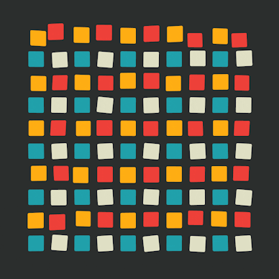
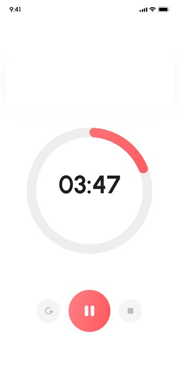
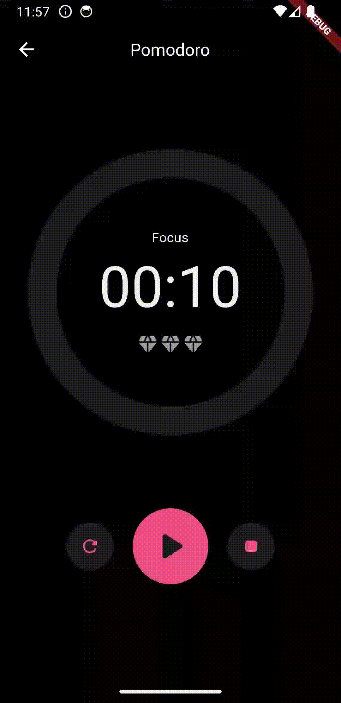
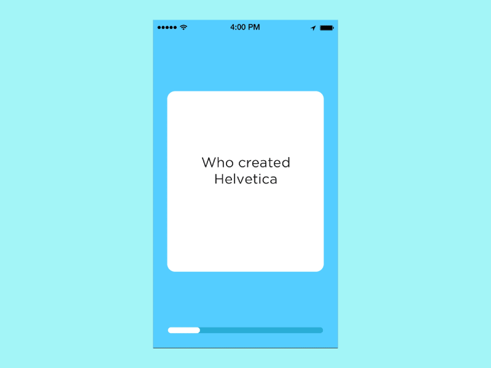

# 플러터 애니메이션 코드챌린지

## 1. Implicit Animations

- `implictly animated widgets`을 이용하여 다음 애니메이션 구현

|                           샘플                           |                      제출한 과제                       |
| :------------------------------------------------------: | :----------------------------------------------------: |
|  |  |

 

## 2. Explicit Animations

- `explictly animated widgets`을 이용하여 다음 애니메이션 구현

|                           샘플                           |        제출한 과제         |
| :------------------------------------------------------: | :------------------------: |
|  |  |

 

## 3. Custom Painter

- CustomPainter를 이용하여 뽀모도로 타이머 구현
- 애니메이션이 적용된 타이머와 버튼 3개(리셋, 재생/일시정지, 중지) 구현

|                        샘플                         |                    제출한 과제                    |
| :-------------------------------------------------: | :-----------------------------------------------: |
|  |  |

 

## 4. Flashcards App

- 플래시카드를 누르면 카드가 뒤집히고 답이 표시되야 한다.
- 카드를 왼쪽으로 끌면 빨간색, 오른쪽으로 끌면 녹색으로 배경색이 바뀌어야 한다.
- 카드를 놓으면 다음 카드가 표시되야 한다.
- 하단에는 플래시카드 진행률 표시줄이 있어야 한다. (CustomPainter로 구현)

|                   샘플                    |              제출한 과제               |
| :---------------------------------------: | :------------------------------------: |
|  |  |

 
