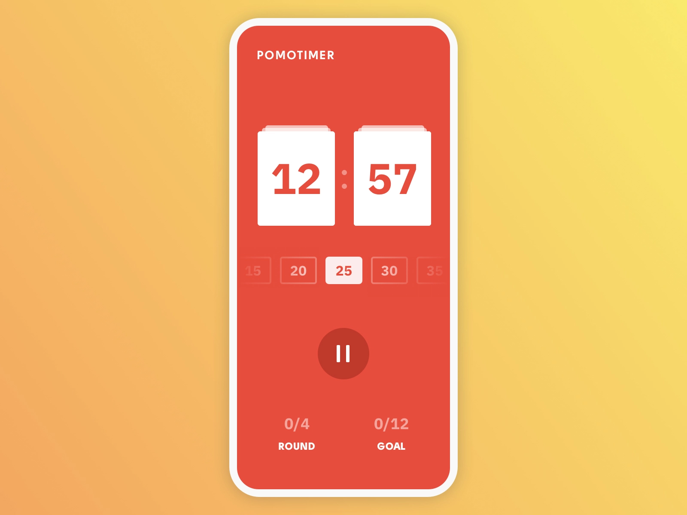

# Pomodoro Challenge

```
1. 유저가 타이머의 시간(15, 20, 25, 30, 35)을 선택할 수 있어야 합니다.
2. 유저가 타이머를 재설정 (리셋)할 수 있어야 합니다.
3. 유저가 한 사이클을 완료한 횟수를 카운트해야 합니다.
4. 유저가 4개의 사이클(1라운드)를 완료한 횟수를 카운트해야 합니다.
5. 각 라운드가 끝나면 사용자가 5분간 휴식을 취할 수 있어야 합니다.
```

<br>

|               구현 과제                |   결과물 (편의상 초 단위로 시연)    |
| :------------------------------------: | :---------------------------------: |
|  |  |
